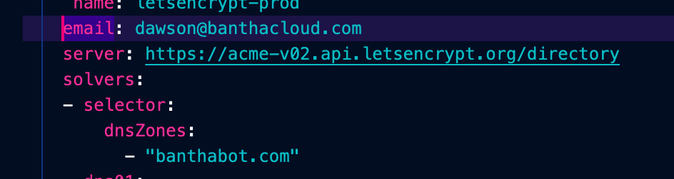
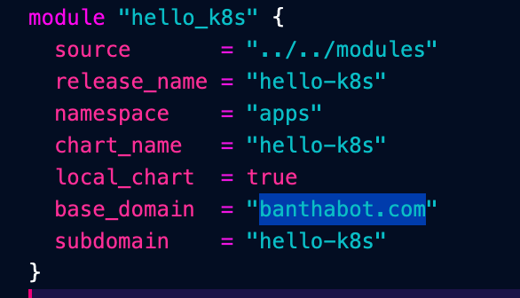

# Cluster-O-Matic
This repo contains sets of Terraform to bring up an EKS cluster and supporting resources in AWS as well as configuring and install base services. 

## Description
A rapid standup of an EKS cluster paired with a currated set of initial services for a quickstart for development.

Services Used:
 * [Cert Manager](https://cert-manager.io) - Automatically requests and keeps SSL certificates up to date via R53 DNS verification.
 * [External DNS](https://github.com/kubernetes-sigs/external-dns) - Automatically creates Route53 records for services.
 * [KIAM](https://github.com/uswitch/kiam) - Keeps least privilege in mind for services that leverage AWS resources.
 * [Metrics Server](https://github.com/kubernetes-sigs/metrics-server) - Used to configure HPA in the cluster.
 * [Nginx-Ingress](https://github.com/kubernetes/ingress-nginx) - Used as the primary ingress point for the cluster and terminates TLS.

 Providers:
* [AWS](https://www.terraform.io/docs/providers/aws/index.html) stands up AWS infrastructure cluster resources.
* [Kubernetes](https://www.terraform.io/docs/providers/kubernetes/index.html) configures Kubernetes cluster components (i.e. namespaces)
* [Helm](https://www.terraform.io/docs/providers/helm/index.html) deploys services into the cluster via community sourced and custom Helm charts.

## Project Structure
The infrastructure for the project is as defined below.

```
├── Makefile <--------------- Contains simple interface for managing components of the cluster.
├── README.md <-------------- This guide to the project.
├── cluster-ops <------------ Contains cluster specific resources (services, general config, etc).
│   ├── apps-services <------ Contains app config and custom charts.
│   │   ├── charts <--------- Custom charts for deploying apps.
│   │   ├── service-values <- App values for deploying with Helm.
│   ├── cluster-config <----- General cluster config via the Kubernetes provider.
│   └── system-services <---- General system services sourced from the community for system operations. 
│       ├── service-values <- Service values for deploying with Helm.
├── infra <------------------ Terraform for AWS resources.
└── modules <---------------- Custom Terraform Modules.
```

## Prereqs
1. An AWS account in which you have configured local credentials, via the awscli, for a user with proper permisisons to create the variety resources required to bring up an EKS cluster.
2. Kubectl and Helm V3 installed locally (`brew install kubectl && brew install helm`). 
3. An AWS S3 bucket for state storage.
4. A Route53 Hosted Zone you can create records in.

## Setup
1. This project contains 4 Terraform providers (1 AWS for infrastructure, 1 for Kubernetes, and 2 for Helm). You will need to do some quick substitution for this to work for you.
    * Replace `bucket = "banthaherder.terraform"` with your statefile bucket name across all 4 providers. For those using VScode this is most easily accomplished with CMD+SHFT+F.
    * Replace `570942073824` with your AWS Account ID. It is used to interpolate for resource creation and resource referencing during service deployment.
    * The Cluster's default name is `Oceanus` which is also used for context referencing, so if you do decide to use a different name ensure it has been updated in the Helm + Kubernetes providers.
    * `/cluster-ops/system-services/cert-generator.yaml` is leveraged to create the ClusterIssuer and you should update it with your email and your R53 zone.
    
    * The `base_domain` is a top level domain name used to automate DNS record creation in the service module. Replace this with the same domain you are using in the ClusterIssuer.
    
2. This project leverages a simple Makefile to execute the Terraform applies in a procedural to bring up and take down a cluster. Executing `make cluster-up` will bring up the infrastructure, configure the local machine's kubeconfig, update the cluster context, configure the cluster's namespaces, bring up system services, and deploy the [hello-k8s](https://github.com/paulbouwer/hello-kubernetes) app.
3. Once it is complete you can view the service at `https://hello-k8s.$YOUR_DOMAIN.com`. Everything has been configured and is good to.
4. To teardown exectute `make cluster-down` in the top level directory. This will inversely tear down the services and resources used to bring the cluster up.

## Continued Development
To continue development of this project view the reference for the project structure above. AWS resources can be added to the `infra` directory, new system/cluster services to the `cluster-ops/system-services` directory, new apps to the `cluster-ops/app-services` directory, new cluster configurations to the `cluster-ops/cluster-config` directory, and module development can be added to in the `modules` directory.

Hello-K8s:
The webpage message can be updated from the env section `cluster-ops/apps-services/service-values/hello-k8s-values.yaml` and the Helm chart can be updated from `cluster-ops/apps-services/charts/hello-k8s/`

## Project Considerations and Improvements
* The EKS cluster implementation could easily be templated into a Terraform module such that multiple cluster envs could be brought up from that source.
* The intial plan was to keep isolate services and cluster configs in the  `cluster-ops` directory to provide a delineation of their purpose. However, it adds overhead to managing state and services and could could be consolidated to a single deployment module that leverages both the Helm and Kubernetes provider to manage the cluster.
* KIAM is a great as it provides an easy way to give cluster services AWS permissions, but the current implementation would be hard to manage and should be broken out into its own module to keep service roles indpedent and maintainable.
* The only resource in the cluster that couldn't be Terraformed is the ClusterIssuer as the Kubernetes provider does not support CRDs. The best recomendation I could find is a local provisioner exec to apply it, but that is not very elegant. A better way would be to include the issuer in a custom modification of the cert manager chart and have Terraform template the domain and email into it when it deploys.
* Once things are fully modularized this setup can be integrated into a pipeline to create an EKS cluster creation job for clustering on the fly.
* Ensure resource limits across services. With HPA enabled it's crucial to ensure a bug doesn't burn your infrastructure bill.
* Implement additional scheduling affinity to schedule backend services to the private node group.